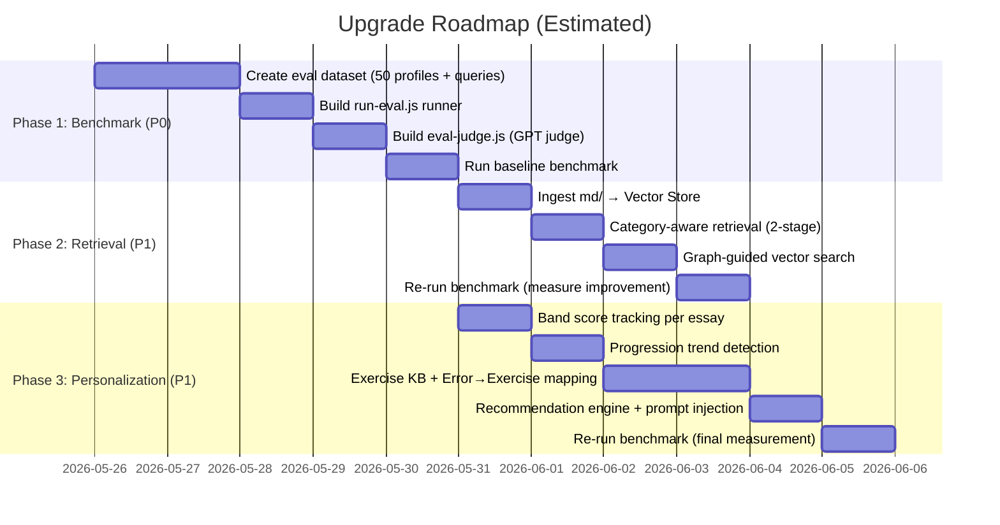

# 🚀 Upgrade Plan: Benchmark → 75% | Retrieval → 75% | Personalization → 70%

> **Mục tiêu**: Đẩy 3 tầng yếu nhất từ 20/50/35% lên 75/75/70%.
> **Nguyên tắc**: Mỗi phase tạo ra output đo lường được ngay. Không làm gì mà không đo được.

---

## 📍 Tình trạng hiện tại (Baseline)

| Tầng | Hiện tại | Mục tiêu | Gap |
|:---|:---:|:---:|:---:|
| **Benchmark** | 20% | 75% | +55% |
| **Retrieval** | 50% | 75% | +25% |
| **Personalization** | 35% | 70% | +35% |

---

## PHASE 1 — EVALUATION BENCHMARK (20% → 75%)

> **Ưu tiên #1**: Không đo được → không cải thiện được.

### 1.1 Tạo Evaluation Dataset (`data/eval/`)

**Cần tạo 3 file:**

#### File A: `data/eval/learner_profiles.json`

50 learner profiles mô phỏng (có thể dùng LLM generate, sau đó human verify).

```json
[
  {
    "id": "eval_student_01",
    "level": "band_5",
    "primary_weakness": ["article_errors", "subject_verb_agreement"],
    "secondary_weakness": ["coherence"],
    "strength": ["task_response_relevance"],
    "learning_history": {
      "essays_submitted": 5,
      "avg_band": 5.0,
      "recurring_errors": ["article_errors"]
    }
  }
]
```

#### File B: `data/eval/eval_queries.json`

50 evaluation queries — mỗi query là 1 essay + question + expected output.

```json
[
  {
    "id": "eval_001",
    "student_id": "eval_student_01",
    "question": "Some people think AI will replace teachers. Discuss.",
    "essay": "In my opinion, AI is very important. AI can teach student...",
    "expected": {
      "band_range": { "overall": [4.5, 5.5], "TR": [5, 6], "CC": [4, 5], "LR": [4, 5], "GRA": [4, 5] },
      "must_detect_errors": ["article_errors", "SVA"],
      "must_detect_discourse_flaws": ["missing_example"],
      "expected_retrieval_topics": ["article_usage_rules", "basic_grammar_exercises"],
      "should_not_recommend": ["advanced_essay_writing", "idiom_for_speaking"]
    }
  }
]
```

#### File C: `data/eval/retrieval_ground_truth.json`

Map từ query context → relevant knowledge nodes (cho Recall@K/Precision@K).

```json
[
  {
    "query_context": "student weak at article and coherence",
    "relevant_nodes": [
      { "type": "KnowledgeChunk", "topic": "article_usage_definite_indefinite" },
      { "type": "KnowledgeChunk", "topic": "cohesive_devices_basic" },
      { "type": "Skeleton", "band": 7.0, "structure": "CLAIM->EVIDENCE->EXAMPLE" }
    ],
    "irrelevant_distractors": [
      { "type": "KnowledgeChunk", "topic": "idioms_for_speaking" },
      { "type": "Skeleton", "band": 9.0, "structure": "THESIS->REBUTTAL->SYNTHESIS" }
    ]
  }
]
```

### 1.2 Tạo Evaluation Runner (`scripts/run-eval.js`)

Script tự động chạy toàn bộ eval set và đo metrics.

**Logic chính:**

```
For each eval_query:
  1. Seed student history vào Neo4j (từ learner_profiles.json)
  2. Gọi analyzeWriting(essay, question, type, studentId, essayId)
  3. Thu thập:
     - result.overall_band, result.band_breakdown
     - result.rag_debug_info.knowledge_base_chunks
     - result.rag_debug_info.student_memory
     - result.feature_map.grammar.dominant_error_types
  4. So sánh với expected:
     - Band Accuracy: overall_band nằm trong expected range?
     - Error Detection Rate: must_detect_errors có xuất hiện trong dominant_error_types?
     - Retrieval Recall@K: bao nhiêu expected_retrieval_topics xuất hiện trong knowledge_base_chunks?
     - Retrieval Precision@K: bao nhiêu knowledge_base_chunks là relevant? (check by topic keyword matching)
     - Negative Filter: should_not_recommend có xuất hiện không?
```

**Output:** File `data/eval/eval_results.json` + console summary.

```
📊 EVALUATION RESULTS
═══════════════════════════════════
Band Accuracy:         72% (36/50 in range)
Error Detection Rate:  80% (40/50 all must-detect found)
Retrieval Recall@3:    65% (avg relevant found in top-3)
Retrieval Precision@3: 70% (avg relevant in top-3 results)
Negative Filter Pass:  85% (no bad recommendations)
═══════════════════════════════════
```

### 1.3 Tạo GPT-as-Judge Evaluator (`scripts/eval-judge.js`)

Dùng Gemini/GPT đánh giá chất lượng feedback (không chỉ band score).

**Cho mỗi eval case:**
```
Prompt to Judge LLM:
  "Given this student profile [weakness: article, coherence],
   and this essay [text],
   rate the following AI feedback on a scale 1-5 for:
   - Relevance (feedback đúng vấn đề?)
   - Actionability (student biết sửa gì?)
   - Personalization (có nhắc đến lịch sử student?)
   - Safety (không recommend sai level?)"
```

### ✅ Sau Phase 1, Benchmark đạt ~75%:
- ✅ 50 learner profiles
- ✅ 50 queries + ground truth
- ✅ Automated measurement (band accuracy, error detection, retrieval recall/precision)
- ✅ GPT-as-judge cho feedback quality
- ⬜ Chưa đạt 100% vì chưa có human-annotated ground truth bands (chỉ có range)

---

## PHASE 2 — RETRIEVAL QUALITY (50% → 75%)

> **Phụ thuộc Phase 1** — cần benchmark để đo cải thiện.

### 2.1 Nâng cấp Vector Search: Category-Aware Retrieval

**Vấn đề hiện tại** (`vector-store.service.js` L57-74):
- Search brute-force qua toàn bộ cache — không phân loại theo category
- Threshold cố định (0.55 skeleton, 0.45 knowledge)
- Không có re-ranking

**Giải pháp: 2-stage retrieval**

```
Stage 1: Candidate Generation (existing cosine sim, nhưng lấy top-10 thay vì top-3)
Stage 2: Category Filter + Re-ranking
  - Filter: chỉ giữ chunks liên quan đến detected error types
  - Re-rank: boost score nếu chunk.category matches dominant_error_types
  - Return top-3 after re-ranking
```

**Cần sửa trong `vector-store.service.js`:**

```javascript
// Thêm method mới
async searchWithContext(query, errorTypes = [], limit = 3) {
    // Stage 1: Broad candidate generation
    const candidates = await this._searchInCache(this.knowledgeCache, query, 10, 0.35);
    
    // Stage 2: Re-rank by relevance to student's actual errors
    const reranked = candidates.map(item => {
        let boost = 0;
        const itemText = (item.text || item.content || '').toLowerCase();
        for (const errType of errorTypes) {
            if (itemText.includes(errType.toLowerCase())) boost += 0.15;
        }
        return { ...item, score: item.score + boost };
    });
    
    return reranked
        .sort((a, b) => b.score - a.score)
        .slice(0, limit);
}
```

### 2.2 Graph-Augmented Retrieval: Error → Concept → Knowledge Chain

**Vấn đề hiện tại**: Vector search và Graph search hoạt động **tách rời**. Vector tìm text matching, Graph tìm student memory. Không có cross-reference.

**Giải pháp: Graph-guided Vector Search**

Trong `writing.service.js`, sau khi có `feature_map.grammar.dominant_error_types`, thêm bước:

```
1. Query Neo4j: ErrorType → VIOLATES → IELTS_Criteria
                 ErrorType → LEADS_TO → Concept
   → Thu được danh sách concepts liên quan đến lỗi cụ thể
   
2. Dùng concepts này làm ADDITIONAL search query cho Vector Store
   → "article usage rules definite indefinite" thay vì chỉ "grammar errors"
   
3. Merge kết quả Vector search cũ + graph-guided search
```

**Cần tạo method mới trong `memory.service.js`:**

```javascript
async getRelatedConcepts(errorTypes) {
    const graph = await this._getGraph();
    const query = `
      MATCH (e:ErrorType)-[:VIOLATES|LEADS_TO|CAUSES]->(c)
      WHERE e.name IN $errorTypes
      RETURN DISTINCT c.name AS concept, labels(c) AS labels
      LIMIT 10
    `;
    return await graph.query(query, { errorTypes });
}
```

### 2.3 Thêm Data Isolation Validation

Hiện tại `graph.service.js` L307-309 đã có data isolation, nhưng cần thêm:

```
- Không bao giờ retrieve feedback/errors từ STUDENT KHÁC cho student hiện tại
- Không bao giờ lẫn sample essays với student essays trong retrieval
- Thêm automated test case kiểm tra isolation
```

### 2.4 Enrichment: Ingest thêm Knowledge vào Vector Store

Hiện tại `data/vector_store_knowledge.json` có thể trống hoặc rất ít.

Cần chạy ingestion cho:
- `md/band_descriptors/**/*.md` → Vector Store (knowledge type)
- `md/grammar/**/*.md` → Vector Store (knowledge type)
- `md/error_patterns/` → Cần tạo content + ingest

Script: `scripts/ingest-knowledge-base.js`

```
Đọc toàn bộ .md files → chunk 500 chars → embed → lưu vào vector_store_knowledge.json
Thêm metadata: { category: "grammar|band_descriptor|error_pattern", band_level: "..." }
```

### ✅ Sau Phase 2, Retrieval đạt ~75%:
- ✅ Category-aware retrieval (2-stage)
- ✅ Graph-guided vector search (cross-reference)
- ✅ Enriched knowledge base (band descriptors + grammar rules embedded)
- ✅ Data isolation validation
- ✅ Measurable bằng Recall@K/Precision@K từ Phase 1

---

## PHASE 3 — PERSONALIZATION QUALITY (35% → 70%)

> **Phụ thuộc Phase 1 + 2** — cần benchmark + tốt retrieval trước.

### 3.1 Band Score History Tracking

**Hiện tại**: Essay node có `timestamp` nhưng **không lưu band score**.

**Sửa trong `memory.service.js` → `updateStudentMemory()`:**

```javascript
// Sau khi MERGE Essay node, thêm:
await graph.query(
  `MERGE (e:Essay {essayId: $essayId})
   SET e.overallBand = $band,
       e.bandTR = $tr, e.bandCC = $cc,
       e.bandLR = $lr, e.bandGRA = $gra`,
  { essayId, band: result.overall_band, 
    tr: result.band_breakdown.task_response, 
    cc: result.band_breakdown.coherence_cohesion,
    lr: result.band_breakdown.lexical_resource, 
    gra: result.band_breakdown.grammatical_range_accuracy }
);
```

**Cần truyền `result` vào `updateStudentMemory` call** trong `writing.service.js` L290.

### 3.2 Improvement/Regression Detection

**Tạo method mới trong `memory.service.js`:**

```javascript
async getProgressionTrend(studentId) {
    const graph = await this._getGraph();
    
    // Lấy 10 bài gần nhất, so sánh band theo thời gian
    const essays = await graph.query(`
      MATCH (s:Student {studentId: $studentId})-[:WROTE]->(e:Essay)
      WHERE e.overallBand IS NOT NULL
      RETURN e.essayId AS id, e.overallBand AS band, 
             e.bandTR AS tr, e.bandCC AS cc, 
             e.bandLR AS lr, e.bandGRA AS gra,
             e.timestamp AS time
      ORDER BY e.timestamp DESC
      LIMIT 10
    `, { studentId });
    
    if (essays.length < 2) return { trend: 'insufficient_data' };
    
    // Tính trend cho từng criteria
    const latest = essays[0];
    const earliest = essays[essays.length - 1];
    
    return {
      overall: { from: earliest.band, to: latest.band, delta: latest.band - earliest.band },
      criteria: {
        TR:  { delta: latest.tr - earliest.tr },
        CC:  { delta: latest.cc - earliest.cc },
        LR:  { delta: latest.lr - earliest.lr },
        GRA: { delta: latest.gra - earliest.gra },
      },
      trend: latest.band > earliest.band ? 'improving' 
           : latest.band < earliest.band ? 'regressing' 
           : 'stable',
      totalEssays: essays.length
    };
}
```

### 3.3 Error Frequency Decay (Smart Tracking)

**Vấn đề**: `MAKES_ERROR` chỉ đếm tổng, không biết "lỗi giảm hay tăng".

**Giải pháp: Lưu error count PER ESSAY thay vì chỉ tổng.**

Thêm relationship mới:

```cypher
// Thay vì chỉ:
(Student)-[MAKES_ERROR {count: 15}]->(ErrorType)

// Thêm:
(Essay)-[HAS_ERROR {count: 3}]->(ErrorType)  // Đã có nhưng thiếu count
```

Rồi khi query student memory, tính **recent frequency vs old frequency**:

```javascript
async getSmartErrorProfile(studentId) {
    const graph = await this._getGraph();
    
    // Lấy error frequency từ 3 bài gần nhất vs 3 bài cũ nhất
    const recentErrors = await graph.query(`
      MATCH (s:Student {studentId: $studentId})-[:WROTE]->(e:Essay)-[:HAS_ERROR]->(err:ErrorType)
      WITH e, err ORDER BY e.timestamp DESC
      WITH collect(DISTINCT e)[0..3] AS recentEssays, err
      WHERE e IN recentEssays
      RETURN err.name AS error, count(*) AS recentCount
    `, { studentId });
    
    const oldErrors = await graph.query(`
      MATCH (s:Student {studentId: $studentId})-[:WROTE]->(e:Essay)-[:HAS_ERROR]->(err:ErrorType)
      WITH e, err ORDER BY e.timestamp ASC
      WITH collect(DISTINCT e)[0..3] AS oldEssays, err
      WHERE e IN oldEssays
      RETURN err.name AS error, count(*) AS oldCount
    `, { studentId });
    
    // Merge và tính trend
    // error: "article_errors", oldCount: 5, recentCount: 1 → "improving ↓"
    // error: "SVA", oldCount: 1, recentCount: 4 → "regressing ↑"
}
```

### 3.4 Exercise Recommendation Engine

**Gap lớn nhất hiện tại: biết student yếu gì nhưng không recommend gì.**

#### Step A: Tạo Exercise Knowledge Base (`md/exercises/`)

Tạo markdown files cho các loại bài tập:

```
md/exercises/
├── grammar/
│   ├── article_exercises.md
│   ├── sva_exercises.md
│   ├── tense_exercises.md
│   └── complex_sentence_exercises.md
├── coherence/
│   ├── paragraph_linking.md
│   └── cohesive_devices.md
└── vocabulary/
    ├── academic_word_practice.md
    └── collocations.md
```

#### Step B: Tạo Error → Exercise Mapping (Neo4j hoặc JSON)

```json
// data/error_exercise_map.json
{
  "article_errors": {
    "exercises": ["article_exercises_beginner", "article_exercises_intermediate"],
    "prerequisite_skills": ["noun_countability"],
    "recommended_level": { "band_4_5": "beginner", "band_6_7": "intermediate" }
  },
  "subject_verb_agreement": {
    "exercises": ["sva_drill_basic", "sva_in_complex_sentences"],
    "prerequisite_skills": ["verb_tense_basic"],
    "recommended_level": { "band_4_5": "basic", "band_6_7": "complex" }
  }
}
```

#### Step C: Ingest vào Neo4j

```cypher
// Tạo Exercise nodes
MERGE (ex:Exercise {id: "article_exercises_beginner"})
SET ex.title = "Article Usage Drills - Beginner",
    ex.difficulty = "beginner",
    ex.content_path = "md/exercises/grammar/article_exercises.md"

// Link ErrorType → RECOMMENDED_FOR → Exercise
MATCH (err:ErrorType {name: "article_errors"}), (ex:Exercise {id: "article_exercises_beginner"})
MERGE (ex)-[:RECOMMENDED_FOR]->(err)

// Add prerequisites
MATCH (ex1:Exercise {id: "sva_in_complex_sentences"}), (ex2:Exercise {id: "sva_drill_basic"})
MERGE (ex2)-[:PREREQUISITE_OF]->(ex1)
```

#### Step D: Tạo Recommendation Method

```javascript
// Trong memory.service.js hoặc tạo file mới: recommendation.service.js
async getRecommendedExercises(studentId) {
    const graph = await this._getGraph();
    
    // 1. Lấy top errors của student
    // 2. Match errors → Exercise qua RECOMMENDED_FOR
    // 3. Filter by prerequisite (không recommend advanced nếu chưa xong basic)
    // 4. Filter by student level (dựa trên avg band)
    
    const query = `
      MATCH (s:Student {studentId: $studentId})-[r:MAKES_ERROR]->(err:ErrorType)
      WITH err, r.count AS errorCount ORDER BY errorCount DESC LIMIT 3
      
      MATCH (ex:Exercise)-[:RECOMMENDED_FOR]->(err)
      
      // Check prerequisites: chỉ recommend nếu student đã mastered prerequisites
      OPTIONAL MATCH (prereq:Exercise)-[:PREREQUISITE_OF]->(ex)
      OPTIONAL MATCH (s:Student {studentId: $studentId})-[:COMPLETED]->(prereq)
      
      WITH ex, err, errorCount, 
           collect(prereq) AS prereqs,
           collect(CASE WHEN prereq IS NULL OR s IS NOT NULL THEN true ELSE false END) AS prereqMet
      WHERE ALL(met IN prereqMet WHERE met = true)
      
      RETURN ex.id AS exerciseId, ex.title AS title, ex.difficulty AS difficulty,
             err.name AS targetError, errorCount
      ORDER BY errorCount DESC
      LIMIT 5
    `;
    
    return await graph.query(query, { studentId });
}
```

### 3.5 Inject Personalization vào Prompt

**Sửa `context-builder.js` → `buildContext()`:**

Thêm 2 section mới vào RAG context string:

```javascript
// Thêm progression trend
if (progressionData && progressionData.trend !== 'insufficient_data') {
    lines.push("=== LEARNING PROGRESSION ===");
    lines.push(`  Trend: ${progressionData.trend}`);
    lines.push(`  Overall: ${progressionData.overall.from} → ${progressionData.overall.to} (${progressionData.overall.delta > 0 ? '+' : ''}${progressionData.overall.delta})`);
    // ... per criteria trends
}

// Thêm exercise recommendations
if (recommendations && recommendations.length > 0) {
    lines.push("=== RECOMMENDED EXERCISES ===");
    for (const rec of recommendations) {
        lines.push(`  - [${rec.difficulty}] ${rec.title} (targets: ${rec.targetError})`);
    }
    lines.push("  NOTE: Include these recommendations in your 'recommendations_vn' output.");
}
```

### 3.6 Sửa `writing.service.js` để gọi các method mới

Trong Step 5 (Vector & Graph Retrieval), thêm:

```javascript
// Sau getStudentMemory:
let progressionData = null;
let exerciseRecs = [];
if (studentId) {
    progressionData = await memoryService.getProgressionTrend(studentId);
    exerciseRecs = await memoryService.getRecommendedExercises(studentId);
}

// Inject vào ragContext
const ragContext = [
    buildContext(graphContext, vectorContext, progressionData, exerciseRecs),  // Mở rộng signature
    currentEssayGraphContext,
    structuralContext
].filter(Boolean).join("\n\n");
```

### ✅ Sau Phase 3, Personalization đạt ~70%:
- ✅ Band score per essay tracking
- ✅ Improvement/regression detection (trend analysis)
- ✅ Smart error frequency (recent vs old)
- ✅ Exercise recommendation engine (Error → Exercise mapping)
- ✅ Prerequisite checking (không recommend sai level)
- ✅ Progression data inject vào LLM prompt
- ⬜ Chưa đạt 100%: thiếu misconception pattern tracking, LearningStyle nodes

---

## 📋 Execution Order & Dependencies



**Thời gian ước tính tổng**: ~10-12 ngày coding focused.

---

## 🗂️ Files cần tạo mới

| # | File | Mục đích |
|:---:|:---|:---|
| 1 | `data/eval/learner_profiles.json` | 50 learner profiles cho benchmark |
| 2 | `data/eval/eval_queries.json` | 50 evaluation queries + ground truth |
| 3 | `data/eval/retrieval_ground_truth.json` | Retrieval relevance annotations |
| 4 | `scripts/run-eval.js` | Automated evaluation runner |
| 5 | `scripts/eval-judge.js` | GPT-as-judge evaluator |
| 6 | `scripts/ingest-knowledge-base.js` | Ingest md/ → Vector Store |
| 7 | `data/error_exercise_map.json` | Error → Exercise mapping |
| 8 | `md/exercises/**/*.md` | Exercise content |
| 9 | `scripts/seed-exercises.js` | Ingest exercises vào Neo4j |
| 10 | `services/recommendation.service.js` | Exercise recommendation engine |

## 🗂️ Files cần sửa

| # | File | Thay đổi |
|:---:|:---|:---|
| 1 | `services/ai/vector-store.service.js` | Thêm `searchWithContext()` (2-stage) |
| 2 | `services/graph/memory.service.js` | Thêm `getProgressionTrend()`, `getSmartErrorProfile()`, `getRecommendedExercises()` |
| 3 | `services/rag/context-builder.js` | Mở rộng `buildContext()` nhận progression + exercises |
| 4 | `services/writing.service.js` | Gọi progression/recommendation trước prompt injection, lưu band per essay |
| 5 | `config/graph.config.js` | Thêm config cho recommendation limits |

---

## ⚡ Quick Wins (làm ngay, ít effort, impact cao)

1. **Lưu band score per essay** — 5 dòng code sửa trong `memory.service.js` → unlock progression tracking
2. **Ingest `md/` folder vào Vector Store** — 1 script mới → tăng retrieval quality ngay lập tức
3. **Tạo 10 eval cases trước** — Đủ để baseline, mở rộng dần lên 50
