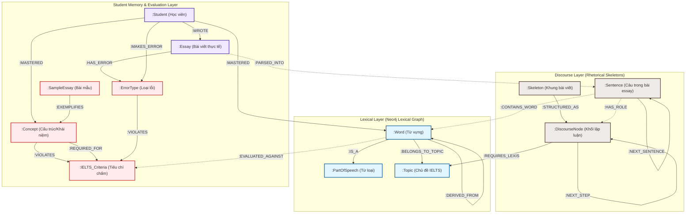

# 🌐 Kiến trúc Đồ thị Tri thức (Knowledge Graph Architecture) — TestKiller IELTS Scoring System

Tài liệu này mô tả chi tiết cấu trúc đồ thị tri thức (Ontology/Schema Graph), các loại Node, thuộc tính (Properties) và các Mối quan hệ (Relationships) trong hệ thống **TestKiller IELTS Hybrid GraphRAG Scoring Engine**. 

Sơ đồ này là hạt nhân giúp hệ thống đạt được tính năng **Explainable AI (XAI)** (giải thích rõ ràng lý do chấm điểm) và **Anti-Hallucination** (chống ảo tưởng lỗi) bằng cách kết hợp cơ chế kiểm tra luật cứng (rule-based NLP), phân tích mạch lập luận (Semantic Discourse Graph) và cơ sở tri thức từ vựng (Oxford Dictionary Graph).

---

## 🏗️ 1. Tổng quan Kiến trúc 3 Lớp (Three-Layer Knowledge Graph Architecture)

Hệ thống quản lý tri thức của TestKiller được chia thành **3 phân tầng** tương tác chặt chẽ với nhau:

1.  **Lexical Layer (Tầng Từ vựng - Neo4j)**: Chứa hơn 48.000 từ vựng Oxford, phân loại từ loại (POS), cấp độ CEFR (A1-C2), từ đồng nghĩa/trái nghĩa và chủ đề IELTS (Topics).
2.  **Discourse Layer (Tầng Mạch lập luận - Neo4j & Vector DB)**: Định hình khung xương bài viết chuẩn IELTS (`Skeleton`) và các khối chức năng (`DiscourseNode`). Khi phân tích bài viết thực tế, tầng này xây dựng một chuỗi các câu liên kết `Sentence` để đo đạc độ gắn kết ngữ nghĩa bằng thuật toán Cosine Similarity.
3.  **Student Memory & Evaluation Layer (Tầng Người học & Đánh giá - Neo4j)**: Lưu trữ lịch sử viết bài của học viên, các lỗi thường gặp (`ErrorType`), các khái niệm ngữ pháp nâng cao (`Concept`), bài viết mẫu (`SampleEssay`), và tiêu chí chấm điểm IELTS (`IELTS_Criteria`).



---

## 📊 2. Mô tả Chi tiết các Node & Mối quan hệ (Entity-Relationship Specs)

Dưới đây là đặc tả chi tiết về các Node, thuộc tính dữ liệu và quan hệ giữa chúng trong cơ sở dữ liệu Neo4j của dự án.

### 2.1 Chi tiết các Node (Vertices)

| Nhãn Node (`Label`) | Thuộc tính (Properties) | Kiểu dữ liệu | Mô tả |
| :--- | :--- | :--- | :--- |
| **`Student`** | `studentId` <br> `username` | String (Unique)<br>String | Đại diện cho một tài khoản học viên trong hệ thống. |
| **`Essay`** | `essayId` <br> `content` <br> `timestamp` <br> `taskType` <br> `overallBand` | String (Unique)<br>String<br>DateTime<br>Integer (1 hoặc 2)<br>Float | Bài luận viết thực tế của học viên được lưu lại để phân tích tiến trình học tập. |
| **`Sentence`** | `sentenceId` <br> `text` <br> `index` <br> `embedding` <br> `discourseTag` | String (Unique)<br>String<br>Integer (0, 1, 2...)<br>Float[] (Vector 384/768)<br>String | Biểu diễn từng câu đơn lẻ trong bài luận để so khớp độ tương đồng và gán nhãn lập luận. |
| **`Word`** | `name` <br> `level` <br> `is_academic` <br> `phonetic` | String (Unique, Lowercase)<br>String (A1, A2, B1, B2, C1, C2)<br>Boolean<br>String (Phiên âm IPA) | Node từ vựng trong hệ từ điển 48k từ. Có thêm nhãn phụ `:Academic` nếu thuộc AWL. |
| **`PartOfSpeech`** | `name` | String (Unique) | Từ loại: `"noun"`, `"verb"`, `"adjective"`, `"adverb"`, `"preposition"`... |
| **`Topic`** | `name` | String (Unique) | Các chủ đề IELTS lớn: `"Environment"`, `"Technology"`, `"Education"`, `"Health"`... |
| **`ErrorType`** | `code` <br> `name` <br> `description` | String (Unique, ví dụ: `SVA`) <br> String <br> String | Danh mục lỗi hệ thống phát hiện (ví dụ: Lỗi hòa hợp chủ vị, Lỗi dấu câu, Lỗi lặp từ...). |
| **`Concept`** | `name` <br> `description` <br> `category` | String (Unique, ví dụ: `Inversion`) <br> String <br> String | Cấu trúc ngữ pháp hoặc từ vựng nâng cao giúp tăng band điểm (ví dụ: Đảo ngữ, Câu chẻ, Cụm phân từ). |
| **`SampleEssay`** | `sampleId` <br> `title` <br> `content` <br> `bandScore` | String (Unique)<br>String<br>String<br>Float | Bài văn mẫu đạt band điểm cao dùng để làm nguồn tham chiếu đối sánh (Exemplar). |
| **`Skeleton`** | `id` <br> `task_type` <br> `genre` | String (Unique)<br>Integer (1 hoặc 2)<br>String (Opinion, Discussion...) | Khung xương mẫu của các dạng bài viết IELTS. |
| **`DiscourseNode`**| `id` <br> `type` <br> `description` | String (Unique)<br>String (Thesis, Claim, Example...)<br>String | Từng mảnh logic lập luận trong một bài viết. |
| **`IELTS_Criteria`**| `name` <br> `fullName` | String (Unique: TR, CC, LR, GRA)<br>String | 4 tiêu chí chấm điểm chính thức của IELTS. |

---

### 2.2 Chi tiết các Mối quan hệ (Edges)

| Nút đi (`Source`) | Loại quan hệ (`Relationship`) | Nút đến (`Target`) | Thuộc tính quan hệ (nếu có) | Giải thích nghĩa |
| :--- | :--- | :--- | :--- | :--- |
| `(s:Student)` | `[:WROTE]` | `(e:Essay)` | `date`: DateTime | Học viên viết một bài luận thực tế. |
| `(e:Essay)` | `[:PARSED_INTO]` | `(s:Sentence)` | Không có | Tách bài viết thành danh sách câu có thứ tự. |
| `(s1:Sentence)` | `[:NEXT_SENTENCE]` | `(s2:Sentence)` | `similarity`: Float (Cosine) <br> `isLogicJump`: Boolean | Liên kết chuỗi câu liên tục. Chứa chỉ số tương đồng ngữ nghĩa để quét lỗi đứt mạch logic (`LOGIC_JUMP`). |
| `(s:Sentence)` | `[:CONTAINS_WORD]`| `(w:Word)` | `frequency`: Integer | Thống kê tần suất xuất hiện của từ vựng thực tế trong câu của bài viết. |
| `(s:Sentence)` | `[:HAS_ROLE]` | `(d:DiscourseNode)` | `confidence`: Float | Gán nhãn vai trò tu từ của câu (Ví dụ: Câu này đóng vai trò là `Example`). |
| `(w:Word)` | `[:IS_A]` | `(p:PartOfSpeech)` | Không có | Xác định từ loại grammatical của từ. |
| `(w:Word)` | `[:BELONGS_TO_TOPIC]`| `(t:Topic)` | `weight`: Float | Gắn từ vựng vào một chủ đề IELTS chuyên sâu. |
| `(w1:Word)` | `[:SYNONYM_OF]` | `(w2:Word)` | `strength`: Float | Quan hệ đồng nghĩa hai chiều. |
| `(w1:Word)` | `[:ANTONYM_OF]` | `(w2:Word)` | Không có | Quan hệ trái nghĩa hai chiều. |
| `(w1:Word)` | `[:DERIVED_FROM]` | `(w2:Word)` | `type`: String (noun-to-adj...) | Từ phái sinh (ví dụ: `"creation"` -> `"create"`). |
| `(s:Student)` | `[:MAKES_ERROR]` | `(err:ErrorType)` | `count`: Integer <br> `lastSeen`: DateTime | Thống kê số lần học viên mắc một lỗi cụ thể để cá nhân hóa lộ trình sửa lỗi. |
| `(s:Student)` | `[:MASTERED]` | `(node)` | `count`: Integer | Ghi nhận học viên đã làm chủ từ vựng hoặc cấu trúc ngữ pháp nâng cao (dùng > 3 lần chính xác). |
| `(se:SampleEssay)`| `[:EXEMPLIFIES]` | `(c:Concept)` | Không có | Bài viết mẫu minh họa trực quan cách dùng một khái niệm ngữ pháp/từ vựng nâng cao. |
| `(c:Concept)` | `[:REQUIRED_FOR]` | `(crit:IELTS_Criteria)`| `minBand`: Float | Cấu trúc ngữ pháp/từ vựng này là bắt buộc để đạt band điểm tối thiểu nào đó ở tiêu chí GRA/LR. |
| `(err:ErrorType)`| `[:VIOLATES]` | `(crit:IELTS_Criteria)`| `penaltyWeight`: Float | Lỗi này vi phạm trực tiếp tiêu chí chấm điểm nào (ví dụ: lỗi chính tả vi phạm LR). |

---

## ⚡ 3. Các Luồng Nghiệp vụ Chấm Điểm qua Đồ thị (Scoring Pipeline Workflows)

Khi học viên nộp bài viết lên hệ thống, các mối quan hệ đồ thị sẽ hoạt động như thế nào? Dưới đây là 3 luồng xử lý thông tin cốt lõi:

### 3.1 Luồng Phân tích Mạch Lập luận (Coherence & Cohesion - CC)
1. Bài viết được tách thành chuỗi `Sentence` liên kết qua `[:NEXT_SENTENCE]`.
2. Hệ thống gọi Local LLM để gắn nhãn tu từ (`Discourse Tagging`) và liên kết mỗi câu với một `DiscourseNode` qua `[:HAS_ROLE]`.
3. Hệ thống so sánh chuỗi thực tế của học viên với khung xương lý thuyết `Skeleton` (Ví dụ: Khung lý thuyết yêu cầu `Claim -> Explanation -> Example`, nhưng học viên lại viết `Claim -> Example -> Example` mà không giải thích).
4. Hệ thống tính độ tương đồng ngữ nghĩa `similarity` giữa các câu kế cận. Nếu `similarity < 0.45`, hệ thống đánh dấu mối quan hệ này là `isLogicJump = true`, tự động tạo một Node lỗi `:ErrorType {code: "LOGIC_JUMP"}` và liên kết bài viết đến lỗi đó.

### 3.2 Luồng Đánh giá Vốn Từ vựng (Lexical Resource - LR)
1. Các từ trong câu được trích xuất, chuẩn hóa (lemmatization) và tìm kiếm Node `:Word` tương ứng thông qua quan hệ `[:CONTAINS_WORD]`.
2. Hệ thống đếm số từ có thuộc tính `level = "C1"` hoặc `"C2"`, hoặc có nhãn `:Academic`.
3. Kiểm tra xem học viên có lặp từ nhiều không bằng cách truy vấn số lượng câu khác nhau liên kết đến cùng một Node `:Word`.
4. Tìm kiếm các quan hệ `[:SYNONYM_OF]` của từ bị lặp trong Lexical Graph để gợi ý từ thay thế thông minh cho học viên ở phần Feedback.

### 3.3 Luồng Đánh giá Ngữ pháp (Grammatical Range & Accuracy - GRA)
1. Bộ kiểm lỗi NLP quét và phát hiện các lỗi ngữ pháp cứng (ví dụ: *Subject-Verb Agreement*).
2. Tạo quan hệ `(e:Essay)-[:HAS_ERROR]->(err:ErrorType {code: "SVA"})`.
3. Đồng thời, bộ phân tích cú pháp xác định các cấu trúc câu nâng cao như đảo ngữ (Inversion), câu phức (Complex Sentence) bằng cách so khớp với Node `:Concept`.
4. Điểm số tiêu chí GRA sẽ là hàm tối ưu hóa giữa tần suất lỗi `:ErrorType` (phạt điểm) và sự đa dạng các `:Concept` nâng cao (cộng điểm).

---

## 🔍 4. Các Truy vấn Cypher Thực tế dùng trong Engine Chấm Điểm

Dưới đây là một số truy vấn Cypher thực tế được nhúng trong mã nguồn microservice để phân tích và chấm điểm bài viết:

### 4.1 Quét lỗi đứt mạch logic (Coherence Scan)
Truy xuất các câu đứng cạnh nhau trong bài luận có độ tương đồng ngữ nghĩa cực kỳ thấp để cảnh báo lỗi nhảy cóc ý tưởng (`LOGIC_JUMP`):
```cypher
MATCH (e:Essay {essayId: $essayId})-[:PARSED_INTO]->(s1:Sentence)-[r:NEXT_SENTENCE]->(s2:Sentence)
WHERE r.similarity < 0.45 AND r.isLogicJump = true
RETURN s1.index AS FromSentenceIndex, s1.text AS Sentence1, s2.text AS Sentence2, r.similarity AS SimilarityScore
ORDER BY FromSentenceIndex
```

### 4.2 Tính chỉ số từ vựng cao cấp (C1/C2 Academic Ratio)
Tính tỷ lệ từ vựng nâng cao (C1, C2 hoặc từ học thuật) được sử dụng trong bài luận để phục vụ chấm điểm tiêu chí **Lexical Resource (LR)**:
```cypher
MATCH (e:Essay {essayId: $essayId})-[:PARSED_INTO]->(s:Sentence)-[:CONTAINS_WORD]->(w:Word)
WITH count(DISTINCT w) AS TotalUniqueWords
MATCH (e:Essay {essayId: $essayId})-[:PARSED_INTO]->(s:Sentence)-[:CONTAINS_WORD]->(w:Word)
WHERE w.level IN ['C1', 'C2'] OR 'Academic' IN labels(w)
WITH TotalUniqueWords, count(DISTINCT w) AS AdvancedUniqueWords
RETURN AdvancedUniqueWords, TotalUniqueWords, 
       (toFloat(AdvancedUniqueWords) / TotalUniqueWords) * 100 AS AdvancedLexicalRatio
```

### 4.3 Phân tích hồ sơ lỗi tích lũy của học viên (Student Weakness Profile)
Tìm ra top 3 lỗi ngữ pháp hoặc cấu trúc lập luận học viên mắc nhiều nhất qua các bài luận để làm báo cáo cá nhân hóa:
```cypher
MATCH (s:Student {studentId: $studentId})-[r:MAKES_ERROR]->(err:ErrorType)
RETURN err.code AS ErrorCode, err.name AS ErrorName, r.count AS Frequency, r.lastSeen AS LastOccurred
ORDER BY Frequency DESC
LIMIT 3
```

---

## 🎯 5. Giá trị Học thuật cho Đồ án Tốt nghiệp (Thesis Innovation Highlights)

Khi trình bày đồ án trước Hội đồng chấm thi, việc tích hợp cấu trúc đồ thị này mang lại **3 giá trị học thuật cốt lõi vượt trội** so với các app học tiếng Anh thông thường:

1.  **Chấm điểm dựa trên Bằng chứng thực thể (Evidence-based Assessment)**:
    *   Hệ thống không nói chung chung "bài viết của bạn chưa tốt". Nó chỉ ra cụ thể: *"Câu số 3 của bạn (Sentence 3) có độ liên kết ngữ nghĩa với Câu số 4 chỉ đạt 0.32, vi phạm cấu trúc khung bài (Skeleton) dạng Opinion Essay, dẫn đến việc bị hạ điểm Coherence xuống Band 5.5."*
2.  **Khắc phục nhược điểm "Hộp đen" của AI (Transparent AI)**:
    *   Mô hình Hybrid kết hợp đồ thị tri thức đóng vai trò như một màng lọc kiểm soát. LLM lớn chỉ làm nhiệm vụ tổng hợp và nhận xét văn phong, còn các số liệu điểm, danh sách lỗi đều được truy xuất trực tiếp từ Neo4j Graph, đảm bảo tính minh bạch, nhất quán và không bao giờ bị ảo tưởng thông tin (hallucination).
3.  **Hệ sinh thái Tri thức Tiến hóa liên tục (Evolving Knowledge Ecosystem)**:
    *   Mỗi khi học viên viết bài, hệ thống vừa chấm điểm vừa cập nhật hồ sơ năng lực học tập (`Student Profile`) vào đồ thị. Từ đó, hệ thống có thể đề xuất bài mẫu cá nhân hóa (`SampleEssay`) có chứa các cụm từ nâng cao tương ứng với các từ mà học viên đang phát triển (`MASTERED` hoặc lỗi thường gặp `MAKES_ERROR`).
