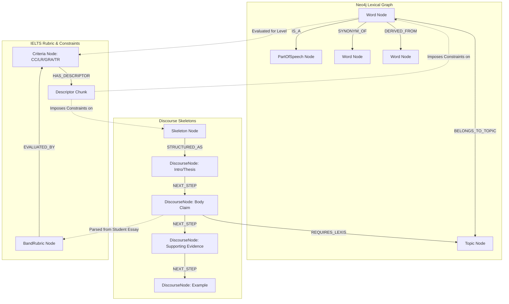
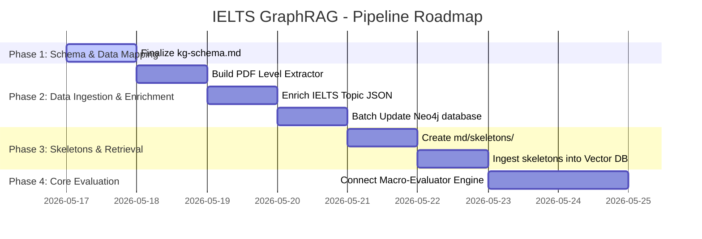

# Knowledge Graph Schema — IELTS scoring engine

This document defines the formal ontology, node types, relationship types, and properties for the **TestKiller IELTS Hybrid GraphRAG Scoring System**. It establishes how lexical data (Neo4j), scoring rules (Markdown Rubrics), and discourse structures (Essay Skeletons) interact.

---

## 1. Conceptual Architecture Overview

The IELTS Knowledge Graph is organized into **Three Core Layers**:
1. **Lexical Layer (Neo4j)**: Contains the 48k+ dictionary words, grammatical POS, synonyms, antonyms, CEFR levels, and IELTS topics.
2. **Discourse Layer (Neo4j & Vector DB)**: Contains structured rhetorical skeletons (`CLAIM -> EVIDENCE -> EXAMPLE`) and transitional flows.
3. **Evaluation Layer (Vector DB & Markdown Chunks)**: Holds the official IELTS Band Descriptors (Bands 0-9) mapped to rules and machine-readable constraints.

---

## 2. Node Schema Definitions

### 2.1 Lexical Layer Nodes

#### A. `Word` Node
Represents a unique English lexical item.
*   **Labels**: `:Word`, `:Academic` (conditional label for advanced academic vocabulary)
*   **Properties**:
    *   `name` (String, Unique Index): The lowercase representation of the word (e.g., `"sustainability"`).
    *   `level` (String): CEFR Level (`"A1"`, `"A2"`, `"B1"`, `"B2"`, `"C1"`, `"C2"`, or `"Unknown"`).
    *   `is_academic` (Boolean): `true` if the word belongs to the Academic Word List (AWL) or Oxford Academic list.
    *   `phonetic` (String): IPA pronunciation (e.g., `"/səsˌteɪnəˈbɪlɪti/"`).

#### B. `PartOfSpeech` Node
Represents the grammatical category of a word.
*   **Labels**: `:PartOfSpeech`
*   **Properties**:
    *   `name` (String, Unique Index): Grammatical category (e.g., `"noun"`, `"verb"`, `"adjective"`, `"adverb"`).

#### C. `Topic` Node
Represents thematic categories aligned with common IELTS Writing themes.
*   **Labels**: `:Topic`
*   **Properties**:
    *   `name` (String, Unique Index): The capitalized name of the theme (e.g., `"Environment"`, `"Education"`, `"Technology"`, `"Health"`, `"Government"`).

---

### 2.2 Discourse Layer Nodes

#### A. `Skeleton` Node
Represents a structural archetype for an IELTS report (Task 1) or essay (Task 2).
*   **Labels**: `:Skeleton`
*   **Properties**:
    *   `id` (String, Unique Index): Unique code (e.g., `"T2_DISCUSSION_ESSAY"`, `"T1_LINE_GRAPH"`).
    *   `task_type` (Integer): `1` or `2`.
    *   `genre` (String): Structure type (e.g., `"discussion"`, `"opinion"`, `"problem_solution"`, `"comparison"`, `"trend"`).

#### B. `DiscourseNode` Node
Represents a functional rhetorical component of a skeleton.
*   **Labels**: `:DiscourseNode`
*   **Properties**:
    *   `id` (String, Unique Index): Segment identifier (e.g., `"T2_DISC_E_CLAIM_1"`, `"T1_LINE_OVERVIEW"`).
    *   `type` (String): Functional type (`"Thesis"`, `"Claim"`, `"Explanation"`, `"Example"`, `"Overview"`, `"Data_Evidence"`, `"Rebuttal"`, `"Conclusion"`).
    *   `description` (String): Instruction on what this component must achieve.

---

### 2.3 Evaluation Layer Nodes (Vector DB / Markdown Representation)

#### A. `BandRubric` Node
Represents an IELTS score band (0 to 9).
*   **Labels**: `:BandRubric`
*   **Properties**:
    *   `band` (Float): E.g., `7.0`, `8.0`.
    *   `task` (Integer): `1` or `2`.

#### B. `Criteria` Node
Represents one of the four IELTS grading criteria.
*   **Labels**: `:Criteria`
*   **Properties**:
    *   `name` (String): `"TR"` (Task Response), `"TA"` (Task Achievement), `"CC"` (Coherence & Cohesion), `"LR"` (Lexical Resource), `"GRA"` (Grammar Range & Accuracy).

---

## 3. Relationship Schema (Edges)

| Source Node | Relationship Type | Target Node | Description |
| :--- | :--- | :--- | :--- |
| `(w:Word)` | `[:IS_A]` | `(p:PartOfSpeech)` | Maps word to its grammatical category. |
| `(w:Word)` | `[:BELONGS_TO_TOPIC]` | `(t:Topic)` | Maps word to its semantic IELTS topic. |
| `(w1:Word)` | `[:SYNONYM_OF]` | `(w2:Word)` | Connects words with similar meaning (bidirectional). |
| `(w1:Word)` | `[:ANTONYM_OF]` | `(w2:Word)` | Connects words with opposite meaning. |
| `(w1:Word)` | `[:DERIVED_FROM]` | `(w2:Word)` | Word derivation (e.g., `"sustainability"` -> `"sustainable"`). |
| `(s:Skeleton)` | `[:STRUCTURED_AS]` | `(d:DiscourseNode)` | Defines the rhetorical blocks of an essay skeleton. |
| `(d1:DiscourseNode)` | `[:NEXT_STEP]` | `(d2:DiscourseNode)` | Defines the sequential flow of discourse blocks. |
| `(d:DiscourseNode)` | `[:REQUIRES_LEXIS]` | `(t:Topic)` | Connects rhetorical blocks to required lexical themes. |
| `(b:BandRubric)` | `[:EVALUATED_BY]` | `(c:Criteria)` | Links score levels to grading categories. |

---

## 4. Closing the Gaps: Actionable Solutions

The user identified **three major gaps** in the current database state:
1. **Vocabulary level missing or "Unknown"** for most of the 48k words.
2. **Thematic topics missing** (currently only 60 words matched in `ielts_topics.json`).
3. **No Essay Skeletons** saved in the database.

Here is the concrete blueprint to patch these gaps immediately:

### Gap 1 & 2 Patch: Automated Vocabulary Level & Topic Classifier
Since the existing `oxford_levels.json` and `ielts_topics.json` are too small, we will build a Python helper script to automatically enrich our database by:
1. Parsing the PDF files `The_Oxford_3000_by_CEFR_level_A1_A2_B1.pdf` and `The_Oxford_5000_by_CEFR_level_B2_C1.pdf` using `pypdf`/`pdfplumber` to extract CEFR levels for the missing words.
2. Expanding `ielts_topics.json` using LLM semantic categorization or an expanded IELTS vocabulary database.
3. Automatically updating existing Neo4j nodes in batches with `SET w.level = ..., w.is_academic = ...`.

### Gap 3 Patch: Standardized Essay Skeleton Corpus
We will define a set of essay skeletons in `md/skeletons/` and write an ingestion script (`ingest-skeletons.js`) to insert these structures directly into Neo4j and the Vector DB namespace.

#### Example Task 2 Discussion Essay Skeleton:
*   **Discourse Nodes**:
    *   `[T2_DISC_INTRO]` -> `[T2_DISC_POSITION]` -> `[T2_DISC_CLAIM_1]` -> `[T2_DISC_EXPLANATION_1]` -> `[T2_DISC_EXAMPLE_1]` -> `[T2_DISC_CLAIM_2]` -> `[T2_DISC_EXPLANATION_2]` -> `[T2_DISC_EXAMPLE_2]` -> `[T2_DISC_CONCLUSION]`.
*   **Rules**:
    *   If `[T2_DISC_EXAMPLE]` is missing -> Cap Task Response score to **Band 6.0**.
    *   If `[T2_DISC_POSITION]` is missing or changes -> Cap Task Response score to **Band 5.0**.

---

## 5. Next Phase Execution Plan

---

> [!NOTE]
> This schema is designed to be fully queryable in Cypher. By storing both Lexical Rules and Skeletons in Neo4j, the LLM will be able to retrieve scoring guidelines and structural exemplars using hybrid queries.
